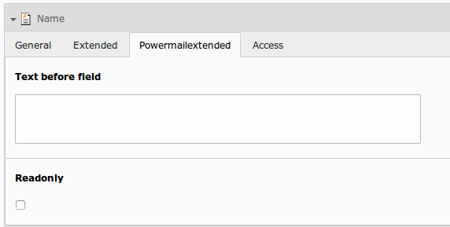

# Add new Field Properties

## Introduction

You can extend powermail fields with new properties to insert (e.g.) a checkbox for readonly or disabled or
something else.

Following example shows two new fields in a new tab "Powermailextended".
The first is a textarea. If there is text stored, this should be outputted before the Input field is rendered.
The second is a checkbox. If this checkbox was checked from an editor, the input field should use the html-attribute
readonly="readonly".




## Extend powermail with an own extension

You have to add one or more fields into tx_powermail_domain_model_field, describe it with additional TCA,
add new Models and change the HTML-Template as you want. You can add a new extension with an example key
powermailextended.

EXT:powermailextended/ext_tables.sql:

```
#
# Table structure for table 'tx_powermail_domain_model_field'
#
CREATE TABLE tx_powermail_domain_model_field (
 tx_powermailextended_powermail_text varchar(255) DEFAULT '' NOT NULL,
 tx_powermailextended_powermail_readonly tinyint(4) unsigned DEFAULT '0' NOT NULL
);
```


EXT:powermailextended/ext_tables.php:

```
<?php
/**
* Include Static TypoScript
*/
\TYPO3\CMS\Core\Utility\ExtensionManagementUtility::addStaticFile(
    $_EXTKEY,
    'Configuration/TypoScript',
    'Powermail Addition (after Powermail Template)'
);

/**
* extend powermail fields tx_powermail_domain_model_field
*/
$tempColumns = array (
'tx_powermailextended_powermail_text' => array(
    'exclude' => 1,
    'label' => 'Text before field',
    'config' => array (
        'type' => 'text',
        'cols' => '32',
        'rows' => '2'
    )
),
'tx_powermailextended_powermail_readonly' => array(
    'exclude' => 1,
    'label' => 'Readonly',
    'config' => array (
        'type' => 'check'
    )
),
);
\TYPO3\CMS\Core\Utility\ExtensionManagementUtility::addTCAcolumns(
    'tx_powermail_domain_model_field',
    $tempColumns
);
\TYPO3\CMS\Core\Utility\ExtensionManagementUtility::addToAllTCAtypes(
    'tx_powermail_domain_model_field',
    '--div--;Powermailextended, tx_powermailextended_powermail_text, tx_powermailextended_powermail_readonly',
    '',
    'after:own_marker_select'
);
```


EXT:powermailextended/Configuration/TypoScript/setup.txt:

```
# Add own Partials
plugin.tx_powermail.view {
    partialRootPaths {
        1 = EXT:powermailextended/Resources/Private/Partials/
    }
}
# Add new Field Properties
config.tx_extbase{
    persistence{
        classes{
            In2code\Powermail\Domain\Model\Form {
                subclasses {
                    0 = In2code\Powermailextended\Domain\Model\Form
                }
            }
            In2code\Powermail\Domain\Model\Page {
                subclasses {
                    0 = In2code\Powermailextended\Domain\Model\Page
                }
            }
            In2code\Powermail\Domain\Model\Field {
                subclasses {
                    0 = In2code\Powermailextended\Domain\Model\Field
                }
            }
            In2code\Powermailextended\Domain\Model\Form {
                mapping {
                    tableName = tx_powermail_domain_model_form
                }
            }
            In2code\Powermailextended\Domain\Model\Page {
                mapping {
                    tableName = tx_powermail_domain_model_page
                }
            }
            In2code\Powermailextended\Domain\Model\Field {
                mapping {
                    tableName = tx_powermail_domain_model_field
                }
            }
        }
    }
    objects {
        In2code\Powermail\Domain\Repository\FormRepository.className = In2code\Powermailextended\Domain\Repository\FormRepository
    }
}
```


EXT:powermailextended/Resources/Private/Partials/Form/Field/Input.html:

```
{namespace vh=In2code\Powermail\ViewHelpers}

<div id="powermail_fieldwrap_{field.uid}" class="powermail_fieldwrap powermail_fieldwrap_input powermail_fieldwrap_{field.uid} {field.css}">
<h2>
    {field.txPowermailextendedPowermailText}
</h2>
<label for="powermail_field_{field.marker}" class="powermail_label" title="{field.description}">
    <vh:string.escapeLabels>{field.title}</vh:string.escapeLabels><f:if condition="{field.mandatory}"><span class="mandatory">*</span></f:if>
</label>
<f:if condition="{field.txPowermailextendedPowermailReadonly}">
    <f:then>
        <f:form.textfield
                type="{vh:Validation.FieldTypeFromValidation(field:field)}"
                property="{field.marker}"
                placeholder="{field.placeholder}"
                readonly="readonly"
                value="{vh:Misc.PrefillField(field:field, mail:mail)}"
                class="powermail_field powermail_input {vh:Validation.ErrorClass(field:field, class:'powermail_field_error')}"
                additionalAttributes="{vh:Validation.ValidationDataAttribute(field:field)}"
                id="powermail_field_{field.marker}" />
    </f:then>
    <f:else>
        <f:form.textfield
                type="{vh:Validation.FieldTypeFromValidation(field:field)}"
                property="{field.marker}"
                placeholder="{field.placeholder}"
                value="{vh:Misc.PrefillField(field:field, mail:mail)}"
                class="powermail_field powermail_input {vh:Validation.ErrorClass(field:field, class:'powermail_field_error')}"
                additionalAttributes="{vh:Validation.ValidationDataAttribute(field:field)}"
                id="powermail_field_{field.marker}" />
    </f:else>
</f:if>

</div>
```


EXT:powermailextended/Classes/Domain/Model/Field.php:

```
<?php
namespace In2code\Powermailextended\Domain\Model;

/**
* Class Field
* @package In2code\Powermailextended\Domain\Model
*/
class Field extends \In2code\Powermail\Domain\Model\Field
{

    /**
     * New property text
     *
     * @var string $txPowermailextendedPowermailText
     */
    protected $txPowermailextendedPowermailText;

    /**
     * New property readonly
     *
     * @var string $txPowermailextendedPowermailReadonly
     */
    protected $txPowermailextendedPowermailReadonly;

    /**
     * @param string $txPowermailextendedPowermailReadonly
     * @return void
     */
    public function setTxPowermailextendedPowermailReadonly($txPowermailextendedPowermailReadonly)
    {
        $this->txPowermailextendedPowermailReadonly = $txPowermailextendedPowermailReadonly;
    }

    /**
     * @return string
     */
    public function getTxPowermailextendedPowermailReadonly()
    {
        return $this->txPowermailextendedPowermailReadonly;
    }

    /**
     * @param string $txPowermailextendedPowermailText
     * @return void
     */
    public function setTxPowermailextendedPowermailText($txPowermailextendedPowermailText)
    {
        $this->txPowermailextendedPowermailText = $txPowermailextendedPowermailText;
    }

    /**
     * @return string
     */
    public function getTxPowermailextendedPowermailText()
    {
        return $this->txPowermailextendedPowermailText;
    }
}
```


EXT:powermailextended/Classes/Domain/Model/Page.php:

```
<?php
namespace In2code\Powermailextended\Domain\Model;

/**
* Class Page
* @package In2code\Powermailextended\Domain\Model
*/
class Page extends \In2code\Powermail\Domain\Model\Page
{

    /**
     * Powermail Fields
     *
     * @var \TYPO3\CMS\Extbase\Persistence\ObjectStorage<\In2code\Powermailextended\Domain\Model\Field>
     */
    protected $fields = NULL;

    /**
     * @param \TYPO3\CMS\Extbase\Persistence\ObjectStorage $fields
     * @return void
     */
    public function setFields($fields)
    {
        $this->fields = $fields;
    }

    /**
     * @return \TYPO3\CMS\Extbase\Persistence\ObjectStorage
     */
    public function getFields()
    {
        return $this->fields;
    }
}
```


EXT:powermailextended/Classes/Domain/Model/Form.php:

```
<?php
namespace In2code\Powermailextended\Domain\Model;

/**
* Class Form
* @package In2code\Powermailextended\Domain\Model
*/
class Form extends \In2code\Powermail\Domain\Model\Form
{

    /**
     * pages
     *
     * @var \TYPO3\CMS\Extbase\Persistence\ObjectStorage<\In2code\Powermailextended\Domain\Model\Page>
     */
    protected $pages;

    /**
     * @param \TYPO3\CMS\Extbase\Persistence\ObjectStorage $pages
     * @return void
     */
    public function setPages($pages)
    {
        $this->pages = $pages;
    }

    /**
     * @return \TYPO3\CMS\Extbase\Persistence\ObjectStorage
     */
    public function getPages()
    {
        return $this->pages;
    }
}
```


EXT:powermailextended/Classes/Domain/Repository/FormRepository.php:

```
<?php
namespace In2code\Powermailextended\Domain\Repository;

/**
* Class FormRepository
* @package In2code\Powermailextended\Domain\Repository
*/
class FormRepository extends \In2code\Powermail\Domain\Repository\FormRepository
{
}
```


Last but not least don't forget to add your static TypoScript template to your powermail page, otherwise the partials will not be used.

Example Code
""""""""""""

Look at https://github.com/einpraegsam/powermailextended for an example extension.
This extension allows you to:

- Extend powermail with a complete new field type (Just a small "Show Text" example)
- Extend powermail with an own Php and JavaScript validator (ZIP validator - number has to start with 8)
- Extend powermail with new field properties (readonly and prepend text from Textarea)
- Extend powermail with an example SignalSlot (see ext_localconf.php and EXT:powermailextended/Classes/Controller/FormController.php)
