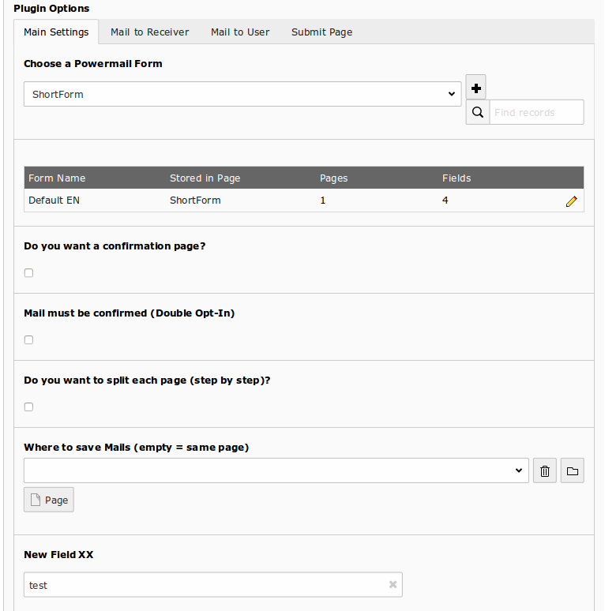

# Add new FlexForm properties

## Introduction

If you want to add new fields to the FlexForm in the plugin, you can simply use a bit of Page TSConfig to do this.
Of course you can access values in new fields with `<f:debug>{settings}</f:debug>` if the fieldname starts with
"settings".



## Example TSConfig

```
tx_powermail.flexForm.addField.settings\.flexform\.main\.test._sheet = main
tx_powermail.flexForm.addField.settings\.flexform\.main\.test.label = New Field XX
tx_powermail.flexForm.addField.settings\.flexform\.main\.test.config.type = input
tx_powermail.flexForm.addField.settings\.flexform\.main\.test.config.eval = trim
```


## Additional notes

* It's only possible to extend the FlexForm of Pi1 at the moment
* Allowed sheets are: main, receiver, sender, thx
* Once you've added a new field and the editor saves values to the new field, you have access in all templates (e.g. {settings.main.test})
* Of course you could also use TYPO3 localization features in sheet labels (e.g. with LLL:EXT:ext/path/locallang_db.xlf:key)
* New fields will be added at the end of the sheet
* In this example only a default input field is rendered. See TCA documentation of TYPO3 which fieldtypes are possible.
